# MindIE Agent architecture

Current design, revised 2026-10-04. This replaces the earlier implementation plan from Issue #195; history remains in Git. The [nine inherited VAWS principles](design-principles.md) govern every adapter. [Implementation status](implementation-status.md) records evidence separately; the simplifications below are requirements, not claims of completed acceptance.

The [complete-material design](transcript-reuse-architecture-2026-10-04.md) defines the current transcript package, ReMe/LangMem boundaries and explicit history import. The implementation is merged; formal installation, public-feed consumption and native acceptance are recorded separately. The earlier native test retains its local-only boundary. A [later authorized synthetic sample](knowledge-review-2026-10-04/evidence/stage5/review.md) separately completed normal Stop, automatic public PR, the existing Grok review/merge and independent HTTPS consumption.

## Product and normal use

MindIE Agent enhances an existing Harness for NPU and infrastructure work. It does not supply its own foundation model, conversation harness, transcript hosting service or online knowledge API. Users work in their own business repositories and native tasks.

A user explicitly invokes the plugin in a task. The first use fills only missing public destination, account and scope information, reusing prior approval. The configured experience loop runs automatically. Missing configuration, explicit disable and component failures are reported distinctly; none is an alternative read-only product tier. Legacy declined settings remain disabled until explicitly changed. General remote-dev tools work without activating knowledge.

Knowledge is optional reference material. Agents choose whether to query, read or give a thumbs-up/down after actual use. There is no mandatory retrieval, report, vote or model-driven closing ceremony.

The current domain is vLLM / vLLM-Ascend. A task uses its selected domain's knowledge and resources; additional domains retain independent content and indexes. Cross-domain assistance uses native tasks with bounded handoff when needed, without a mandatory router, global knowledge index or new conversation framework. Business source and native worktrees remain owned by the user and Harness.

## Repositories and ownership

| Component | Owns |
| --- | --- |
| This architecture repository | Product semantics, domain boundaries, design decisions and cross-adapter delivery status |
| Codex, Kimi and Claude Code adapter repositories | Native task identity, explicit entry, onboarding, Hook translation, public transcript parsing, native model invocation, plugin installation and update |
| Shared knowledge runtime | Admission, bounded increments, redaction and organization coordination, retrieval, optional feedback, publication receipts and cleanup |
| Public domain knowledge repository | Reviewed Markdown content, versions and distribution through GitHub |
| Existing Grok Bot application | Review proposed public content for sensitive or impermissible material and trigger appropriate merges, corrections or removal |
| remote-dev | Remote files, commands, jobs, cancellation and artifacts, independent of knowledge activation |
| diagnostics | Bounded local logs, actionable fault references and independently authorized, finite GitHub Issue reporting; shared by all adapters |
| coordinator and other existing tools | Their own bounded execution or diagnostic duties, only when the actual task needs them |

Adapters reuse the same knowledge and remote-dev implementations. Native identity and transcript formats stay in adapters. A shared runtime must not import a host-specific lease table or guess a task from the latest session or working directory. Adapter separation does not justify a second knowledge database or publishing protocol.

Grok Bot means the installed bot application, not Grok CLI. There is no routine-wide one-merge quota, arbitrary candidate count or mandatory twenty-minute review window.

## Contribution and reuse loop

```mermaid
flowchart LR
    A["Native task<br/>explicit plugin activation"] --> C{"Destination and task scope configured?"}
    C -->|Missing| R["Report missing configuration<br/>reuse approved values"]
    R --> C
    C -->|Configured and enabled| H["Bounded Stop notification<br/>public task increment only"]
    H --> L["Harness parser selects public messages<br/>local rules redact and save the body"]
    L --> M["LangMem through the native small model<br/>index complete new blocks and short navigation"]
    M --> P["Complete indexed package<br/>automatically propose a GitHub PR"]
    P --> B["Existing Grok Bot reviews and merges"]
    B --> K["Public Markdown domain repository"]
    K --> S["Local synchronization and rebuildable index"]
    S --> N["A new task optionally reads and uses experience"]
    N -.-> F["Optional helpful / unhelpful feedback"]
    F -.-> B
```

Missing configuration, explicit disable, scope mismatch and a component fault are distinct states, not successful alternative product modes. Explicit disable and legacy declined settings stop new collection; migration must not silently enable them. Task binding alone never establishes that capture or contribution completed. Retrieval and remote tools remain independently usable.

When enabled, only the explicitly admitted native task and authorized project scope can contribute. Forks and new tasks have separate identities. Disable cancels unsent work; re-enable admits subsequent material, not an automatic replay of old history. Raw transcripts remain local and never become GitHub content.

The Hook only admits a bounded notification and exits normally. It must not require the business model to continue its turn. Parsing and model work happen outside the short Hook budget. Every operation has its own time/output boundary; failed model input is not automatically retried. Unknown publication results are reconciled against the original remote branch/PR before another write.

Task length, accumulated experience body size and total corpus size are not admission limits. Long tasks use incremental reads, saved progress and bounded individual model calls; the component must continue through all admitted material without truncating the remainder or requiring a new user task. Bound the memory, concurrency and time of each operation, not the lifetime of useful work. Internal processing chunks and submission coalescing are implementation details, not user-managed batches or fixed experience counts.

The body is the ordered, locally redacted public conversation. Codex implements
this first: user input, public assistant progress and final answers survive;
tool calls/results, hidden reasoning, injected instructions and native duplicate
wrappers do not. Compaction uses no model and does not shorten public messages.
Body and cursor commit together. Gitleaks plus explicit privacy rules run before
storage, model input or publication; repository review cannot undo a secret
uploaded in an earlier commit. Rule scanning cannot establish the publicness of
proprietary meaning, so existing project authorization remains necessary.

Only block retrieval headers and short task navigation may come from the
adapter-owned model. LangMem processes each complete new batch plus the previous
short navigation through the existing native Harness; it never rewrites the
body or rereads all prior material for a final merge. The merged Codex implementation
uses `gpt-5.6-luna` with low effort independently of the business model.
Required indexing failure does not prevent local capture, but the incomplete
package cannot publish. There is no source-excerpt or first/last fallback.
Known usage and failed or uncertain outcomes remain recorded; a saved returned
response resumes local application without another call. Failed or uncertain
native calls require explicit retry.

Live Stop intake and explicit historical import share the same projection,
redaction, incremental queue and package logic. History import requires an
explicitly selected source and reuses existing contribution scope; it does not
activate historical sessions or discover unrelated history. Consumers reuse
producer headers and build only local ReMe indexes, without another model call.
Claims remain attributed and uncertain. Other Harnesses require their own
adapter update and acceptance; this Codex implementation does not establish that evidence.

Publishing uses the already prepared public body. Creating or updating the PR is mechanical and does not need another model rewriting pass. The existing Bot reviews content rather than manufacturing a second corpus-processing pipeline.

## Public records and lightweight local state

Public entries are complete ordinary Markdown task packages: one navigation manifest binds ordered stable material blocks, their hashes and fallible retrieval headers. Keep a clear title, retrieval summary and the knowledge/experience distinction. Optional `conditions` holds relevant software versions or source commits; absent values are allowed. Device choices, shapes, seeds, tolerances and command details belong in the body.

Local ownership, session provenance, retry bookkeeping, authorization and receipts remain local. Do not expose internal producer IDs, empty source arrays or routine lifecycle fields as public content. An entry's identity must support reference and feedback, but its exact storage belongs to the knowledge component contract; changing a title is not a required lifecycle step.

A submission receipt records the exact PR head and complete package. Current
local material remains available until the confirmed public feed supplies that
revision; resolved frozen-send payloads can then be retired without another
publication. Later additions use the current valid feed package and append only
new admitted material. Independent remote changes are checked at the exact
head; conflicting packages require review and are never silently rewritten or
merged by a second model. Keep current authority files and necessary unresolved
send payloads, not a per-revision body archive. Withdrawn material is unavailable
and superseded fixed references expire explicitly.
Unknown write outcomes retain the minimum reconciliation material and are checked before another write. Transient network and local staging failures resume quietly through the existing background worker with durable backoff, per-attempt timeouts and stable operation identities. A local export reservation is not a sent receipt and must not permanently consume material before an outbox exists. Neither recovery nor plugin update resets the capture boundary or permits replay of failed model work. Content rejection and deliberate remote removal are not transient failures: do not reopen or republish the rejected content automatically.

Contribution remains a persistent opt-in choice. Routine work needs no per-entry approval, discard decision or batch management. Confirmed submission cleanup and minimum duplicate-prevention receipts are internal responsibilities.

Markdown files are the body authority. SQLite holds small cursor, queue and outcome transactions; ReMe owns derived file/chunk/BM25 retrieval in the same process. Derived caches may contain material text and are rebuildable; no raw Harness transcript archive or second body database is introduced. LangMem is used as a function, without another graph store or background service.

## Feedback and maintenance

Thumbs-up/down is a loose, optional usefulness signal, not truth certification. Missing feedback is not a negative vote. A consumer can explain whether an entry helped or misled it; the producer's self-assessment is not independent reuse evidence.

Negative feedback gives an unhelpful entry an exit path. Maintenance can correct or remove it from the distributed corpus; Git retains normal history. No public `retired` record or empty retirement reason is required after removal.

Repeated useful experience may suggest a Skill, but automatic Skill extraction is a future capability requiring a concrete useful example. Do not prebuild confidence ladders, promotion thresholds, compulsory judging calls or a second evaluation service. Skills mainly explain capabilities and methods; knowledge stays advisory.

## Activation, execution and updates

Native task identity, authorization, an in-flight operation, an MCP connection and a remote job have different lifetimes. Explicit authorization persists until disabled or changed in scope. It does not expire merely because time passes or the runtime directory changes.

Adapters track remote `main` commits now; release tracking is a later change. An update stages the complete adapter, Skills, Hooks and pinned runtime, verifies the selected native package and actually loaded resources, and atomically commits one generation. Every operation uses a coherent scripts/interpreter/configuration tuple.

Actual in-flight work blocks switching. An idle authorized task or an old unknown PR receipt does not. The runtime's idle decision and admission freeze must be atomic. The original task must still control its existing remote job after an update.

When switching requires stopping a live local knowledge service, the updater preserves that fact and restores service under the selected generation if valid explicit task authorization remains. Restoration binds the selected Harness profile and its existing model configuration; process readiness alone does not establish that later organization can use that model. A durable admitted Stop notification can request a bounded wake outside the Hook; it does not start a business turn or replay a missing event. Query and wake paths reconcile the actual endpoint and generation before starting one owned service. An interrupted handoff remains observable and may resume through these existing paths after rechecking authorization and process ownership; it must not require the user to discover a CLI command.

Plugin and feed updates classify failures. Temporary connectivity, rate limits and interrupted IO back off through the existing scheduler, honoring server retry guidance; three such failures must not permanently exclude an otherwise valid commit. Invalid content or incompatible generations remain isolated while the last working version stays available. Each attempt stays bounded; a later background network attempt is not another model attempt. Status records the last success, fault category and next recovery time. Authentication or native trust failures request the one necessary external action; routine connectivity failures do not wake the user or business model. Stable management entrypoints dispatch to the selected generation rather than an outdated installer copy.

Keep necessary old entrypoints and rollback data while a host may still use them. Installed files, definitions loaded into a live task, and Hook trust are separate facts. A host-required trust review is never bypassed or silently granted by an updater.

Native identity binding must use verified host evidence. Missing metadata can be bridged by an exact one-shot native tool event binding, never by guessing from content, timestamps or the latest task. A remote tool's job `session_id` alias is not a native task credential.

Detailed lifecycle semantics are in [Harness boundaries and lifecycle](harness-boundary-and-lifecycle.md).

## Diagnostics and fault reporting

Original component failures carry a local diagnostic reference and useful recovery facts. Logging has byte, count and age limits; offline maintenance protects live writers and every registered reader. Logging or reporting failure never changes the original business outcome or replays the operation.

Automatic tool-fault reporting is an independent optional user choice, separate from knowledge contribution. One shared reporter publishes only allowlisted code and execution facts, without transcripts, command arguments, raw output or model analysis. Expected caller, configuration, cancellation, connectivity and ordinary remote command failures do not automatically become product bug Issues. Stable fingerprints deduplicate across tasks; finite persisted processing budgets also cover readback and crashes. Unknown writes reconcile without automatic reposting.

The native adapters expose configuration and status; service installation runs outside short Hooks. They do not add a global all-task failure Hook or separate reporter per host. See [diagnostics and reporting](diagnostics-and-reporting.md) for the implementation contract and acceptance boundaries.

## Delivery and acceptance

Codex, Kimi and Claude Code have independent repositories and native acceptance. Current Codex business tests use gpt-6-luna / max in Windows PowerShell and WSL. This business setting never selects metadata effort: Codex body capture calls no model, and optional title/summary generation uses the adapter's internal GPT-6-Luna / low policy, with no user configuration. This metadata policy has completed real calls on both platforms. Kimi model acceptance is currently deferred; Claude Code's configured model must be named accurately in its own evidence.

Windows hardware is available for current PowerShell and WSL acceptance. Earlier macOS evidence remains scoped to its recorded versions and behavior. Windows CI does not prove native Stop delivery, actual NPU execution or public contribution: those boundaries require the controlled native run.

Development checks, native installation, real Hook delivery, a real public PR/Bot merge, and usefulness in a new task are recorded separately. A registry success, connected MCP panel or old revision's evidence cannot stand for the final implementation.

The current work prioritizes the lifecycle and knowledge loop across these three adapters. Old business Skills, profiling analysis, automatic Skill extraction and further domain/Harness expansion remain deferred. Cross-domain work may reuse native tasks and existing tools when needed; there is no compulsory domain router or new conversation framework.

The old VAWS bootstrap, source/worktree manager and legacy installation path remain retired. This permission to rewrite product internals does not authorize deletion of unrelated user repositories, private material or running resources.
